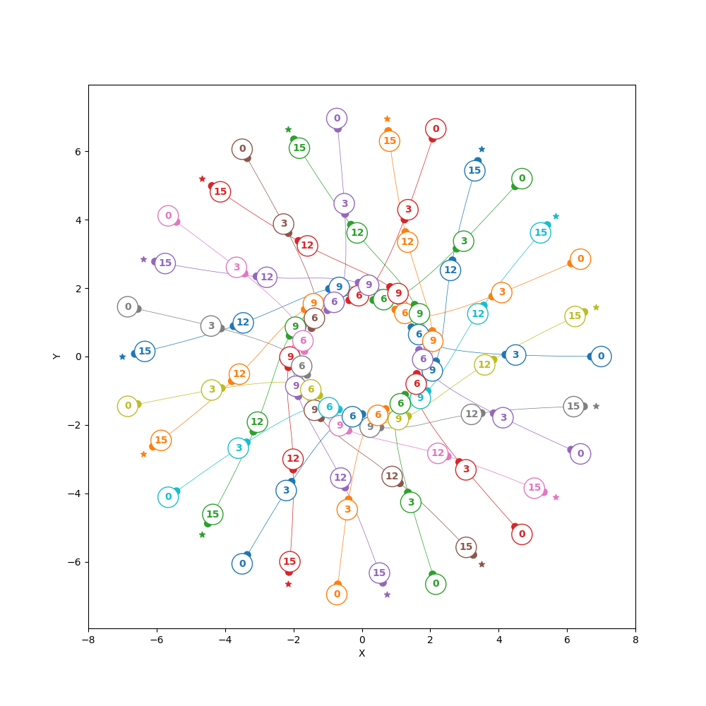
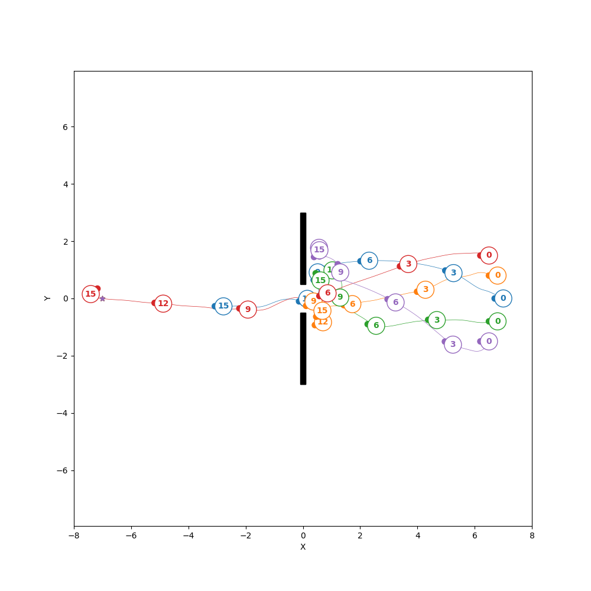
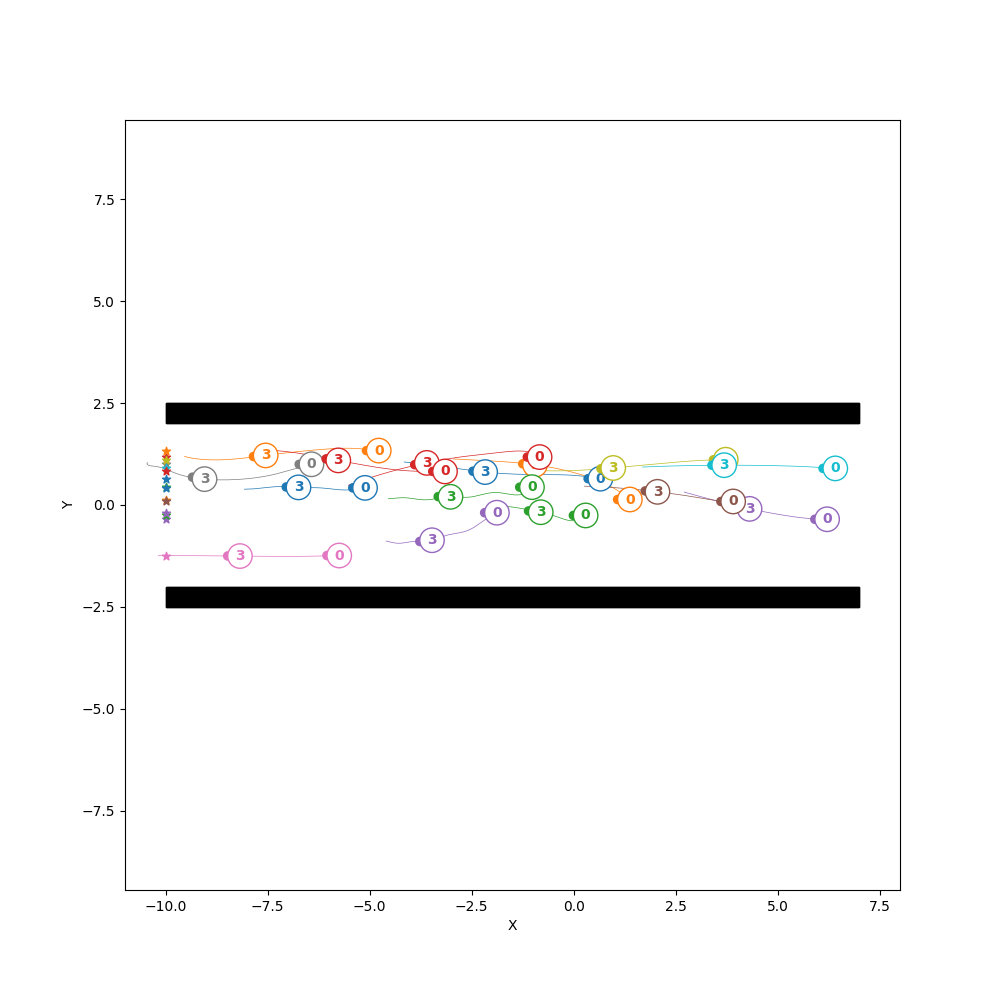

# JHSFM (JAX Headed Social Force Model)

> A JAX based implementation of the Headed Social Force Model in Python.



## Description
This repository contains an implementation of the **Headed Social Force Model** to simulate human motion in Python. Following the current programming trend, the code is based on the well-known **JAX** Python library that allows fast computations thanks to vectorization, parallelization and accelerated linear algebra.

The main contribution of this repo is the ***step()*** method which takes in input the current state, goals and parameters of all humans and returns the updated state using a given sampling time dt. Moreover, the repo includes methods to generate humans' initial conditions, parameters, and goals with a few lines of code.

Finally, **some examples** are included to show how the model can be used in practice and how humans move following the HSFM.

Note that this implementation of the HSFM differs from the original one in [[1]](#1). It implements a modification proposed in [[2]](#2) to introduce a sliding component in the repulsive forces and has a slightly modified torque equation in order for humans' orientation to follow the direction of the sum of all forces (not only the goal attractive force as in the original one).

## Table of contents
- [Installation](#installation)
- [Getting started](#getting-started)
- [References](#references)

## Installation
This code has only been tested in Python 3.10 but it might also work with other interpreters. Hereafter, a simple step-by-step guide for installation is presented. 

### Step-by-step installation guide
First of all, creating a Python virtual environment is a good practice when starting new projects. You can do that with the well-known virtualenv package (pip install virtualenv):
```
virtualenv jhsfm
```
Now that the virtualenv has been created using your default Python interpreter, you can activate the environment:
```
source jhsfm/bin/activate
```
After that, its time to clone this repo:
```
git clone https://github.com/TommasoVandermeer/JHSFM.git
```
Finally, you need to install the requirements and then you can install the package:
```
cd JHSFM
pip install -r requirements.txt
python3 setup.py install
```
You have successfully installed the package. Whenever you are done using this code, remember to deactivate your virtualenv:
```
deactivate
```

## Getting started
As previously mentioned, the repository includes three examples the can be run to learn the implementation details.

### Example one
Example 1 simulates the circular crossing scenario, a scenario widely employed in the reasearch community. Each human is positioned (randomly or evenly spaced) in the boundary of a circle and its goal is to reach the point diametrically opposite to its initial position. To run it use:
```
python3 example1.py
```


### Example two
Example 2 simulates a scenario in which several pedestrians need to go through a narrow passage (e.g., a door). To run it use:
```
python3 example2.py
```


### Example three
Example 3 simulates a scenario in which humans flow in a large corridor all in the same direction to reach the othe end. To run it use:
```
python3 example3.py
```


## References
<a id="1">[1]</a> Farina, Francesco, et al. "Walking ahead: The headed social force model." PloS one 12.1 (2017): e0169734.

<a id="2">[2]</a> Guo, Ren-Yong. "Simulation of spatial and temporal separation of pedestrian counter flow through a bottleneck." Physica A: Statistical Mechanics and its Applications 415 (2014): 428-439.
